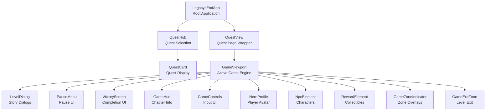

# System Architecture

## Component Hierarchy



## Service & Controller Ownership

### 🌐 Application-Level (LegacysEndApp)

**Global Services** - Shared across entire app:
- `ThemeService` - Global theme state (Dark/Light/System)
- `ProgressService` - Save/load progress
- `LocalizationService` - i18n translations
- `Router` - URL routing
- `QuestRegistryService` - Quest metadata and data loading

**Global Providers**:
- Provides contexts for all services mentioned above.

### 📄 Quest-Page Level (QuestView)

**Role**: Page wrapper. Handles routing params (`questId`, `chapterId`) and renders the Engine. Consumes global services to manage the high-level game state.

### 🎮 Game-Engine Level (GameViewport)

**Role**: The actual game engine. Orchestrates domain-specific controllers.

**Domain State Services** (Provided via Context):
- `HeroStateService` - Player character state
- `QuestStateService` - Active quest progression state
- `WorldStateService` - Environmental and UI engine state

**Game-Specific Controllers** (Owned by components):
- `KeyboardController`
- `VoiceController`
- `CollisionController`
- `GameZoneController`
- `InteractionController`
- `QuestController` - Orchestrates the flow between chapters.

## Context API Strategy

The project uses `@lit/context` for dependency injection. 

### Provision
**In LegacysEndApp (Global providers):**
```javascript
this.sessionServiceProvider = new ContextProvider(this, { context: sessionServiceContext, ... });
```

### Consumption
**Components consume services via decorators:**
```javascript
@consume({ context: questStateContext, subscribe: true })
accessor questState;
```

## Reactivity Strategy

We use **Lit Signals** (`@lit-labs/signals`) for fine-grained reactivity.
- **Services** expose signals as properties.
- **Components** use the `SignalWatcher` mixin to automatically track dependencies.
- **Controllers** read signals to perform logic (e.g., collision detection based on hero position).

## Directory Structure

```
src/
├── contexts/                 # Context Definitions
├── game/                     # Game-Specific Logic
│   ├── contexts/             # Domain Contexts
│   ├── services/             # Domain Services (Hero, Quest, World)
├── services/                 # Global Services (Theme, Session, Progress)
├── controllers/              # Reactive Controllers
├── components/               # Lit Components
└── use-cases/                # Pure Business Logic
```

