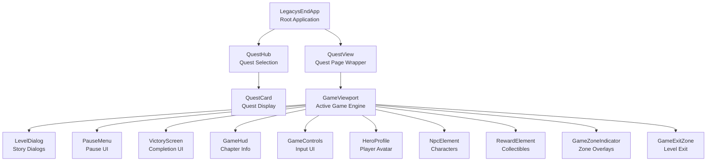

# Component Architecture & Context Strategy

## Component Hierarchy



## Service & Controller Ownership

### 🌐 Application-Level (LegacysEndApp)

**Global Services** - Shared across entire app:
- `ThemeService` - Global theme state (Dark/Light/System)
- `ProgressService` - Save/load progress
- `QuestController` - Quest data & navigation
- `LocalizationService` - i18n translations
- `Router` - URL routing
  - *App relies on Router to switch between Hub and Game views*

**Global Providers**:
- `ThemeProvider` - Theme mode context (Global)

### 📄 Quest-Page Level (QuestView)

**Role**: Page wrapper. Handles routing params (`questId`, `chapterId`) and renders the Engine.

**Dependencies**:
- `Router` (Global)

### 🎮 Game-Engine Level (GameViewport)

**Role**: The actual game engine. Owns state, loop, and controllers.

**Game Services** (Instantiated & Provided here):
- **Domain State Services**:
  - `HeroStateService`
  - `QuestStateService`
  - `WorldStateService`
- **Player Services**:
  - `ProfileService` (User profile data)
  - `CharacterService` (Equipment/Stats)
  - `SessionService` (Session tracking)
- `AIService`
- `VoiceSynthesisService`

**Game-Specific Controllers** (Instantiated here):
- `KeyboardController`
- `VoiceController`
- `CollisionController`
- `GameZoneController`
- `InteractionController`
- `GameController`
- `ServiceController`
- `CharacterContextController`

**Dependencies from App** (via Context):
- ✅ `themeService` - For visual theming
- ✅ `localizationService` - For text translation
- ✅ `progressService` - For saving game progress
- ✅ `questController` - For quest data/assets logic

### 📺 Visual Components (Children of Viewport)

**Pure Presentation**:
- Consumes Game Contexts provided by Viewport.
- Dispatches UI events to Viewport.

## Context API Strategy

### Phase 1: Create Service Contexts

Create context definitions:

```javascript
// src/contexts/game-state-context.js
export const gameStateContext = createContext(Symbol('game-state'));

// src/contexts/ai-service-context.js
export const aiServiceContext = createContext(Symbol('ai-service'));

// ... etc for all services
```

### Phase 2: Provide Contexts

**In LegacysEndApp (Global providers):**
```javascript
this.sessionServiceProvider = new ContextProvider(this, { context: sessionServiceContext, ... });
// ...
```

**In GameViewport (Game Engine Providers):**
```javascript
// GameViewport creates services and provides them to its UI children
this.heroStateProvider = new ContextProvider(this, { context: heroStateContext, ... });
this.questStateProvider = new ContextProvider(this, { context: questStateContext, ... });
this.worldStateProvider = new ContextProvider(this, { context: worldStateContext, ... });
```

### Phase 3: Consume Contexts

**QuestView consumes global contexts:**
```javascript
new ContextConsumer(this, { context: routerContext, ... });
```

**GameViewport consumes game contexts:**
```javascript
new ContextConsumer(this, { context: heroStateContext, ... });
new ContextConsumer(this, { context: questStateContext, ... });
new ContextConsumer(this, { context: worldStateContext, ... });
```

## Benefits of Context Approach

1. **Decoupling**: GameView doesn't need to know about LegacysEndApp
2. **Testability**: Easy to provide mock contexts in tests
3. **Explicit Dependencies**: Clear what each component needs
4. **Type Safety**: Better TypeScript/JSDoc support
5. **Scalability**: Easy to add new services without prop drilling

## Migration Strategy

### Option A: Big Bang (Risky)
- Refactor everything at once
- High risk of breaking changes
- All tests need updating

### Option B: Incremental (Recommended)
1. Keep `app` prop for backward compatibility
2. Add context consumers alongside
3. Gradually migrate controllers to use contexts
4. Update tests incrementally
5. Remove `app` prop when all migrations complete

### Option C: Hybrid (Pragmatic)
1. Fix current keyboard bug with minimal changes ✅ (DONE)
2. Document architecture (this doc)
3. Create contexts for new features going forward
4. Refactor existing code opportunistically
5. Full migration as separate epic

## Recommendation

**Use Option C (Hybrid)** - **STATUS: COMPLETED ✅**
- The hybrid approach was successfully executed.
- Core architecture (Contexts + Domain Services) is in place.
- Legacy `GameSessionManager` has been decomposed.
- Validation of new patterns is complete.

## Next Steps

1. ✅ **Extract Theme**: `ThemeService` created and provided.
2. ✅ **Define Session**: `SessionService` created. `QuestLoaderService` handles orchestration.
3. ✅ **Standardize Classes**: `QuestRegistryService`, `AIService` implemented as injectable classes.
4. ✅ **Wiring**: `LegacysEndApp` fully converted to Context Provider root.
5. 🔄 **EventBus Refactoring**: `EventBus` still exists. Plan to refactor `QuestController` signals or direct service calls to remove it.
6. 🔄 **Quest Registry**: Ensure `QuestRegistryService` is fully utilized across the app and legacy data access is minimized.
7. 🗑️ **Cleanup**: Remove properly deprecated files/code (e.g. any remaining `CommandBus` references if any).

## Service Interfaces (Draft)

### `ThemeService` (Global)
Responsible for application-wide visual preferences.
```typescript
interface ThemeService {
  themeMode: Signal<'light' | 'dark' | 'system'>;
  setTheme(mode: 'light' | 'dark' | 'system'): void;
  toggleTheme(): void;
}
```

### `HeroStateService` (Game-Level)
Responsible for hero-specific ephemeral state.
```typescript
interface HeroStateService {
  position: Signal<{x: number, y: number}>;
  isEvolving: Signal<boolean>;
  updatePosition(x: number, y: number): void;
}
```

### `QuestStateService` (Game-Level)
Responsible for active quest progress (flags, collection).
```typescript
interface QuestStateService {
  currentQuestId: Signal<string | null>;
  currentChapterId: Signal<string | null>;
  flags: Signal<Map<string, boolean>>;
  hasCollectedItem: Signal<boolean>; // Per-chapter
  
  setFlag(key: string, value: boolean): void;
}
```

### `WorldStateService` (Game-Level)
Responsible for environmental and UI state.
```typescript
interface WorldStateService {
  isPaused: Signal<boolean>;
  sceneId: Signal<string>;
  showDialog: Signal<boolean>;
  lockedMessage: Signal<string | null>;
  
  pause(): void;
  resume(): void;
}
```

## Directory Structure Proposal

```
src/
├── contexts/                 # Global Context Definitions
│   ├── theme-context.js      # Global
│   ├── localization-context.js # Global
│   └── ...
├── game/                     # Game-Specific Logic
│   ├── contexts/             # Game-Level Context definitions
│   │   ├── game-state-context.js
│   │   ├── ai-context.js
│   │   └── ...
│   ├── services/             # Game-Specific Services
│   │   ├── game-state.js     # Unified State
│   │   └── ...
│   └── ...
└── services/                 # Global Services
    ├── theme-service.js
    ├── session-service.js
    └── ...
```

## Refactoring Strategy: GameSessionManager

**Current Problem**: `GameSessionManager` is a "God Class" handling state, navigation, UseCase orchestration, and event listening.

**Target Architecture**: Decompose into focused services.

### 1. `SessionService` (State Only)
Holds the source of truth for "Where are we?".
```typescript
interface SessionService {
  currentQuestId: Signal<string | null>;
  currentChapterId: Signal<string | null>;
  viewMode: Signal<'HUB' | 'GAME' | 'LOADING'>;
}
```

### 2. `Router` (Direct Usage)
Use the existing Router utility directly for URL updates and navigation events.
- `Router.go('/hub')`
- `Router.go('/quest/:id')`

### 3. `QuestLoader` (Orchestration)
Handles the complex logic of preparing a quest (assets, state reset).
```typescript
interface QuestLoader {
  loadQuest(questId: string): Promise<boolean>;
  loadChapter(chapterId: string): Promise<boolean>;
}
```

## Service Audit & Decoupling Plan

This detailed review ensures every service has a single responsibility and correct scope.

| Service | Current Scope | Responsibility | Issues | Status |
| :--- | :--- | :--- | :--- | :--- |
| **GameStateService** | **Legacy** | Mixed State | **God Object** | ✅ **Split**: Decomposed into Hero/Quest/World State services. |
| **HeroStateService** | **Game** | Hero Pos/Status | New | ✅ **Created**: Fully implemented & provided. |
| **QuestStateService** | **Game** | Progression/Flags | New | ✅ **Created**: Fully implemented & provided. |
| **WorldStateService** | **Game** | Pause/Env/Dialog | New | ✅ **Created**: Fully implemented & provided. |
| **ThemeService** | Global | Visual Theme | New | ✅ **Created**: Fully implemented & provided. |
| **GameSessionManager** | **God Class** | Orchestration | **God Object** | ✅ **Removed**: Replaced by `QuestLoaderService` + `SessionService`. |
| **QuestLoaderService** | Global | Lifecycle Manager | New | ✅ **Created**: Orchestrates Start/Continue/Complete flows. |
| **SessionService** | Global | User Session | New | ✅ **Created**: Manages current quest/view state. |
| **GameService** | Global | Facade | Redundant | ✅ **Removed**: Logic moved to controllers/services. |
| **ProgressService** | Global | Persistence | Well designed | ✅ **Keep**: Provided globally. |
| **QuestRegistryService** | Global | Quest Data | Data Access | ✅ **Created**: Replaces legacy static registry functions. |
| **LocalizationService** | Global | i18n & Locale State | Well designed | ✅ **Keep**: Provided globally. |
| **AIService** | Global | Chrome AI Wrapper | Singleton | ✅ **Refactored**: Injected via Context. |
| **VoiceSynthesisService** | Global | Speech API Wrapper | Singleton | ✅ **Refactored**: Injected via Context. |
| **EventBus** | Global | Global Events | Redundant | ⚠️ **Pending**: Still heavily used. Target for future refactoring. |
| **CommandBus** | Global | Command Execution | Complexity Glue | ✅ **Removed**: Controllers call services directly. |
| **UserServices** | Global | API Client | Data Fetcher | ✅ **Renamed**: `UserApiClient` implemented. |
| **PreloaderService** | Global | Asset Preloading | Utility | ✅ **Keep**: Remains a utility. |

## Refactoring Order (Completed)
1.  ✅ **Extract Theme**: `ThemeService` created.
2.  ✅ **Define Session**: `SessionService` & `QuestLoaderService` created.
3.  ✅ **Standardize Classes**: Core services converted to Classes.
4.  ✅ **Wiring**: `LegacysEndApp` provides all contexts.
5.  ✅ **Decommission**: `GameSessionManager`, `GameService`, `CommandBus` removed.

