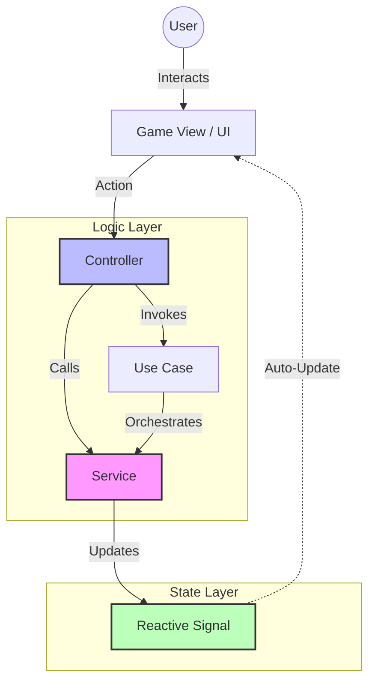

# Legacy's End - Technical Reference

This document provides a detailed reference for the core modules of the project: Services, Managers, Controllers, Components, and Mixins.

---

## 🧠 Architectural Decisions & Patterns

### 1. High-Level Architecture



### 2. Reactive Signals Pattern
**Question**: Why do the domain state services (Hero, Quest, World) use Lit Signals?

**Reasoning**:
In standard Lit applications, state is usually managed within components using reactive properties. However, in a game engine, state often needs to be accessed and modified by purely logical entities (Managers, Controllers) that are *not* UI components.

### 5. Reactive State Derivation (New)
**Principle**: "Reactive State derivations over Imperative Synchronization".
**Reasoning**: avoid "Glue Code" (manually syncing state between parents and children via events). Prefer **Reactive Primitives** (`@lit/task`, Signals) that derive UI state directly from usage. If a Controller has the data, share the Controller (or a Context), do NOT copy the data to the App component just to pass it down.

*   **Decoupling Logic from UI**: State services can run game logic, update coordinates, or handle quest progression without needing a DOM element.
*   **Fine-Grained Reactivity**: By using `@lit-labs/signals`, services become pinpoint reactive data sources. UI components only re-render when the specific signals they use are updated.
*   **Automatic Dependency Tracking**: Components using the `SignalWatcher` mixin automatically track which signals they access in `render()`, removing the need for manual `subscribe()` and `unsubscribe()` boilerplate.
*   **Multiple Consumers**: A single signal update (e.g., `hasCollectedItem.set(true)`) can simultaneously update the HUD, trigger a sound effect manager, and notify the Quest Controller, without these systems knowing about each other.

### 2. Dependency Injection (DI) via Context
**Pattern**: Usage of `@lit/context` and standardized Interfaces.

**Reasoning**:
To avoid "Prop Drilling" (passing data through many layers of components), we use Lit Context to provide service instances. However, components should NOT depend on concrete classes. They MUST depend on **Interfaces** defined in `src/game/interfaces.js` or `src/services/interfaces.js`. This allows for easy mocking in tests and swapping implementations (e.g., swapping a `LocalStorageService` for a `CloudStorageService`) without changing component logic.

### 3. Service-Controller-Component Triad
**Pattern**: Strict separation of concerns.

*   **Service**: "Source of Truth". Holds domain data and business logic (e.g., `HeroStateService`, `QuestStateService`, `WorldStateService`).
*   **Controller**: "Brain". Reactive Controllers that hook into the component lifecycle to bridge services and UI (e.g., `KeyboardController`).
*   **Component**: "View". Purely visual representation of the state (e.g., `GameViewport`).
    *   **The Component** provides or consumes the context.
    *   **The Controller** independently requests the services it needs via `ContextConsumer`.

1.  **Controller Responsibility**: The controller is responsible for requesting the services it needs via `ContextConsumer`.
2.  **host**: The controller uses the host only for lifecycle hooks and event dispatching.
3.  **Reactivity**: The controller sets up context consumers with `subscribe: true`. If a service value changes, the controller reacts by updating its internal state and/or requesting a host update (`this.host.requestUpdate()`).

### 5. Alternative Considered: Services as Lit Controllers?
**Question**: Why not implement State Services directly as [Lit Reactive Controllers](https://lit.dev/docs/composition/controllers/)?

**Reasoning**:
Lit Controllers are powerful but are designed to be **bound to a specific host component's lifecycle**.
*   **Lifecycle Limitations**: A Controller is instantiated by a component (`new Controller(this)`). If we moved the state logic entirely into a Controller, every component would have its own isolated instance of the state, or we would still need a singleton backing store.
*   **Architecture Choice**: We use **Services** for *singletons* that exist independently of the UI (Data Layer), and **Controllers** for logic that *must* interact with the Component Lifecycle (Inputs, Timers, View Bindings).

### 5. Historical Context: Migration from the Observable Pattern
**Question**: Why was the custom `Observable` implementation replaced with Signals?

**Reasoning**:
The project originally used a custom `Observable` implementation for coarse-grained reactivity. In Phase 9, this was migrated to native Lit Signals for several benefits:

*   **Performance**: Signals offer true fine-grained reactivity, reducing unnecessary re-renders in complex views like `GameView`.
*   **Maintainability**: Removed manual subscription management. Components now use the `SignalWatcher` mixin.
*   **Boilerplate Reduction**: Eliminated the need for `GameStateMapper` and manual `syncState` methods in the root component.

### 6. Event System Removal
**Question**: Why was the global `EventBus` removed?

**Reasoning**:
*   **Traceability**: Direct method calls and Signals are easier to trace in IDEs than loose event strings.
*   **Decoupling**: Eliminates the "Implicit Dependency" on a central bus. Components declare exactly what they need (`WorldStateService`, `QuestController`).
*   **Simplicity**: specialized logic (like level completion) is now handled via explicit methods on `GameController` or domain services rather than generic event listeners.

---

## 🏗️ Services (`src/services/` and `src/game/services/`)

Services are pure logic classes that manage specific domains of the application state or business logic. They are often unrelated to the UI and can be injected via Context.

### `HeroStateService`
**Purpose**: Manages the ephemeral state of the player character.
**Type**: Signal Provider (uses `@lit-labs/signals`).

*   **State Properties**:
    *   `pos`: `{x, y}` coordinates of the player.
    *   `isEvolving`: Boolean, true during character transformation animations.
    *   `hotSwitchState`: `HotSwitchState` indications for API context visual effects.
    *   `imageSrc`: Current sprite source.

### `QuestStateService`
**Purpose**: Manages active quest progression metadata and session-specific goals.
**Type**: Signal Provider (uses `@lit-labs/signals`).

*   **State Properties**:
    *   `hasCollectedItem`: Boolean, true if the level's objective item is collected.
    *   `isRewardCollected`: Boolean, true if the visual reward sequence is finished.
    *   `isQuestCompleted`: Boolean, global completion flag.
    *   `questTitle` / `levelTitle`: Display strings.
    *   `currentChapterNumber` / `totalChapters`: Progress counters.

### `WorldStateService`
**Purpose**: Manages environmental and UI engine state.
**Type**: Signal Provider (uses `@lit-labs/signals`).

*   **State Properties**:
    *   `isPaused`: Boolean, game pause state.
    *   `showDialog`: Boolean, visibility of the storytelling dialog.
    *   `currentSlideIndex`: Number, current active slide in the dialog. **Automatically resets to 0 when `showDialog` is set to true.**
    *   `currentDialogText` / `nextDialogText`: Narrative strings.

### `ProgressService`
**Purpose**: Manages long-term player progression and persistence.
**Dependencies**: `StorageAdapter` (defaults to localStorage), `QuestRegistry`.

*   **State Tracks (`ProgressState`)**:
    *   `completedQuests`: Array of quest IDs.
    *   `completedChapters`: Array of chapter IDs.
    *   `unlockedQuests`: Quests available to play.
    *   `achievements`: Earned badges.
    *   `stats`: Aggregate metrics (`totalPlayTime`, `questsCompleted`).
    *   `currentQuest` / `currentChapter`: Active session pointers.

*   **Key Methods**:
    *   `loadProgress() / saveProgress()`: Handles persistence.
    *   `completeChapter(chapterId)`: Marks a chapter as done.
    *   `completeQuest(questId)`: Marks a quest as done and unlocks subsequent content.
    *   `getQuestProgress(questId)`: Returns a percentage (0-100).
    *   `resetProgress()`: Wipes all user data (for testing/reset).

### `LoggerService`
**Purpose**: Centralized logging utility with log levels (`debug`, `info`, `warn`, `error`).
**Usage**: Injected via `options.logger` (Controllers/Managers) or `@consume` (Components).

### `StorageService`
**Purpose**: Abstract interface for data persistence.
**Implementations**:
*   `LocalStorageAdapter`: Wraps browser `localStorage` with JSON parsing and error handling.


### `UserServices` (`LegacyUserService`, `MockUserService`, `NewUserService`)
**Purpose**: Mock implementations of a backend user API, used to demonstrate the "Strategy Pattern" and dependency injection in gameplay (Level 6).
**Interface (`IUserService`)**:
*   `fetchUserData(id)`: Returns `Promise<UserData>`.
*   `getServiceName()`: Returns `ServiceType` (`legacy`, `mock`, `new`).
**Context**:
*   `ServiceType` Enum: Defines the available service modes.
*   Used by `ServiceController` to switch implementations dynamically (polymorphism).

---

## ⚙️ Managers (`src/managers/`)
(Deprecated & Removed. Logic moved to Services.)

### `SessionService`
**Purpose**: Manages the meta-game session (Hub vs Game, Loading state).
**Location**: `src/services/session-service.js`

---

## ⚡ Commands (`src/commands/`)
(Deprecated & Removed. Controllers call Services directly.)

---

## 🧠 Use Cases (`src/use-cases/`)

Pure domain logic encapsulated in single-responsibility classes. These contain the "business rules" of the game, independent of the UI or specific controllers.

### `EvaluateChapterTransitionUseCase`
**Purpose**: Determines if the player can advance to the next chapter or if the quest is complete.
**Used By**: `QuestController`.

### `ProcessGameZoneInteractionUseCase`
**Purpose**: Analyzes the hero's position to detect Theme Zones (visual changes) or Context Zones (API hot-swapping).
**Used By**: `GameZoneController`.

---

## 🎮 Controllers (`src/controllers/`)

Controllers are specialized classes (often using Lit's Reactive Controller pattern) that handle specific functional aspects of the application.

### `QuestController`
**Purpose**: Manages the orchestration of Quest progression (chapters, transitions, completion).
**Type**: Lit Reactive Controller.
**Architecture**: Delegates transition logic to `EvaluateChapterTransitionUseCase`.
**Inputs**:
*   `QuestControllerOptions`: Callbacks for quest/chapter events and progress service.
**Outputs**:
*   `onQuestStart(quest)`: Triggered when a quest starts.
*   `onChapterChange(chapter, index)`: Triggered when chapter changes.
*   `onQuestComplete(quest)`: Triggered when quest completes.
*   `onReturnToHub()`: Triggered when returning to hub.
**Key Methods**:
*   `startQuest(questId)`: Starts a new quest (resets progress for that quest).
*   `continueQuest(questId)`: Resumes from the first uncompleted chapter.
*   `nextChapter()`: Advances to the next chapter (resets UI state for the new chapter).
*   `completeQuest()`: Marks quest as completed.

### `KeyboardController`
**Purpose**: Handles keyboard input (WASD, Arrows, Space, Escape).
**Type**: Lit Reactive Controller.
**Inputs**:
*   `KeyboardOptions`: Callbacks for movement, interaction, and pause.
*   Keyboard events (WASD, Arrow keys, Space, Escape).
**Outputs**:
*   `onMove(dx, dy)`: Triggered on movement keys.
*   `onInteract()`: Triggered on Space key.
*   `onPause()`: Triggered on Escape key.
**Key Logic**:
*   **Escape**: Always triggers pause, even when input is disabled.
*   **isEnabled check**: Blocks movement and interaction when disabled (e.g., during dialogs).
*   **Prevents default**: Stops browser scrolling on arrow keys.

### `InteractionController`
**Purpose**: Detects proximity to NPCs and handles "Interact" actions.
**Type**: Lit Reactive Controller.
**Inputs**:
*   `handleInteract()`: Called on user input (e.g., Spacebar).
*   `InteractionOptions`: Callbacks for game state access and UI triggers.
**Outputs**:
*   `onShowDialog()`: Opens the dialog UI.
*   `onLocked(msg)`: Triggers a "locked" feedback message.
**Key Logic**:
*   **Proximity**: Hero must be within `interactionDistance` (default 15) of the NPC.
*   **Use Case Delegation**: Uses `InteractWithNpcUseCase` for validation.

### `CollisionController`
**Purpose**: Handles AABB (Axis-Aligned Bounding Box) collision detection and exit zone triggers.
**Type**: Lit Reactive Controller.
**Key Logic**:
*   **Signal Observation**: Reads `HeroStateService` and `QuestStateService` to react to position changes.
*   `checkExitZone()`: Determines if the player has entered the level exit area (only active if item is collected).
*   `checkAABB(box1, box2)`: Generic collision utility.

### `GameZoneController`
**Purpose**: Detects special zones within a level based on player position.
**Type**: Lit Reactive Controller.
**Architecture**: Delegates zone logic to `ProcessGameZoneInteractionUseCase`.
**Key Logic**:
*   **Signal Observation**: Reads `HeroStateService` to trigger zone checks.
*   **Direct State Update**: Updates `themeMode` or `hotSwitchState` based on use case results.

### `ServiceController`
**Purpose**: Manages the loading of async data (simulated) from the active `UserService`.
**Type**: Lit Reactive Controller.
**Inputs**:
*   `ServiceControllerOptions`: Services map, profile provider, and callbacks.
*   `getActiveService(serviceType, hotSwitchState)`: Dynamic service selection.
**Outputs**:
*   `ServiceController` exposes `userTask` (Lit Task) for reactive consumption.
**Key Logic**:
*   `userTask`: Handles async data fetching responsibilities reactively.
*   **Dynamic Service Selection**: For `serviceType === "new"`, switches between legacy/new based on `hotSwitchState`.

### `CharacterContextController`
**Purpose**: Synchronizes the visual state of the character (sprites) with the game state context (Providers).
**Type**: Lit Reactive Controller.
**Inputs**:
*   `getState()`: Function returning current Level, Chapter Data, User Data, etc.
**Outputs**:
*   Updates the `CharacterContext` (Suit).
**Logic**:
*   **Suit**: Determines correct sprite based on Level Config and collected rewards.

### `VoiceController`
**Purpose**: Handles Web Speech API integration for voice commands with AI-powered natural language processing.
**Type**: Lit Reactive Controller.
**Architecture**: Consumes `LoggerService`, `AIService`, `VoiceSynthesisService`, `LocalizationService`, and `DialogStateContext` via Lit Context for full independence.
**Inputs**:
*   Voice commands in English or Spanish (e.g., "move left", "interact", "go to NPC").
**Outputs**:
*   Movement callbacks (`onMove`, `onMoveToNpc`, `onMoveToExit`).
*   Interaction callbacks (`onInteract`, `onPause`, `onNextSlide`, `onPrevSlide`).
*   Voice feedback via `window.speechSynthesis` (Alarion's persona).
**Key Features**:
*   **Web Speech API**: Continuous voice recognition with auto-restart and exponential backoff.
*   **Chrome Built-in AI**: Optional integration with Prompt API for context-aware command interpretation.
*   **Multilingual**: Supports English (`en-US`) and Spanish (`es-ES`) with automatic language detection.
*   **Voice Synthesis**: Text-to-speech feedback with character-appropriate voices.
*   **Context-Aware**: Uses game state (dialog open, reward collected) to interpret ambiguous commands like "next".
**Browser Support**: Chrome/Edge (Web Speech API required).

### `GameController`
**Purpose**: The primary interface for high-level game operations and orchestration. It coordinates between UI components and domain services.
**Type**: Lit Reactive Controller.
**Inputs**:
*   `?debug` query parameter in URL (enables debug mode).
*   `GameControllerOptions`: Injected `SessionService` and `LoggerService`.
**Outputs**:
*   Console logs for state inspection in debug mode.
*   `handleLevelCompleted()`: Public method called by GameView when a level is finished.
*   `handleExitZoneReached()`: Public method called by CollisionController when the exit is reached.
*   **Note**: `window.game` has been removed.

### `GameService`
(Deprecated & Removed. Logic distributed to specialized services.)

---

## 🧩 Components (`src/components/`)

Visual UI elements built with `Lit`.

### `QuestView`
**Element**: `<quest-view>`
**Purpose**: The main page wrapper for active gameplay.
**State**: Manages the high-level layout, rendering `GameViewport`, `PauseMenu`, `VictoryScreen`, and `LevelDialog` based on reactive state.

### `GameViewport`
**Element**: `<game-viewport>`
**Purpose**: The "World" canvas where the game engine runs.
**Responsibilities**:
*   Coordinates domain controllers (Collision, Interaction, GameZone).
*   Renders the Hero, NPCs, Rewards, and background.
*   Handles CSS-based animations (Hero movement, Reward collection sequence).

### `QuestHub`
**Element**: `<quest-hub>`
**Purpose**: The main menu screen for quest selection.
**Features**:
*   Grid of `QuestCard` components.
*   Progress visualization and persistent state management via `ProgressService`.

### `LevelDialog`
**Element**: `<level-dialog>`
**Purpose**: Modal interface for narrative progression and chapter completion.
**Structure**:
*   **Slides**: Narrative -> Code Snippets -> Problem -> Architectural Analysis -> Confirmation.
*   **Reactivity**: Purely functional consumer of `WorldStateService.currentSlideIndex`.

### `HeroProfile`
**Element**: `<hero-profile>`
**Purpose**: Renders the player character status and avatar.
**Features**:
*   Context-aware styling based on `HeroStateService`.
*   Composites multiple images based on active equipment and API context.

### `NpcElement` / `RewardElement`
**Elements**: `<npc-element>`, `<reward-element>`
**Purpose**: Purely visual entities in the viewport that react to position and state.

### `VictoryScreen`
**Element**: `<victory-screen>`
**Purpose**: Overlay shown when an entire Quest is completed.

### `PauseMenu`
**Element**: `<pause-menu>`
**Purpose**: In-game menu for session management.

---

## 🧪 Mixins (`src/mixins/`)

### `SignalWatcher`
**Purpose**: Automated dependency tracking for Lit Signals.
**Usage**: Applied to any component that reads values from domain services in its `render()` method.

---

## 🔌 Service Usage & Dependency Injection

### How Services are Consumed
Services are designed as **Singletons** and are primarily accessed via **Lit Context** (`@lit/context`). This ensures any component in the tree can access the service instance without prop drilling.

1.  **Instantiation**: Services are instantiated in `GameBootstrapper` and owned by `LegacysEndApp`.
2.  **Provision**: `LegacysEndApp` provides the contexts to the entire component tree.
3.  **Consumption**: Child components use the `@consume` decorator with the `accessor` keyword to get the service instance.

### Access Pattern
```javascript
import { SignalWatcher } from "@lit-labs/signals";
import { consume } from "@lit/context";
import { questStateContext } from "../game/contexts/quest-context.js";

class MyNewComponent extends SignalWatcher(LitElement) {
  /** @type {import('../game/interfaces.js').IQuestStateService} */
  @consume({ context: questStateContext, subscribe: true })
  accessor questState = /** @type {import('../game/interfaces.js').IQuestStateService} */ (/** @type {unknown} */ (null));

  render() {
    // Simply access signals; the mixin tracks dependencies automatically
    const title = this.questState.questTitle.get();
    return html`<h1>${title}</h1>`;
  }
}
```

### Consumer Map
| Service Interface | Consumers (Examples) | Usage |
| :--- | :--- | :--- |
| `IQuestStateService` | `QuestView`, `GameViewport`, `GameHud` | Chapter metadata, completion status. |
| `IHeroStateService` | `HeroProfile`, `GameViewport`, `GameZoneController` | Hero position, evolution state, effects. |
| `IWorldStateService` | `QuestView`, `LevelDialog`, `PauseMenu` | Dialog navigation, pause state. |
| `ISessionService` | `LegacysEndApp`, `QuestView`, `QuestController` | Meta-game state (Hub vs Game). |
| `IQuestController` | `QuestHub`, `LevelDialog`, `PauseMenu` | Direct orchestration of quest flow. |
| `IProgressService` | `QuestController`, `QuestHub` | Persistent saving and loading. |
| `ILoggerService` | `*` | Unified logging through the application. |

### How to Include a Service in a New Component
To use an existing service (e.g., `QuestStateService`) in a new component:

1.  **Import the Context and Decorators**:
    ```javascript
    import { consume } from "@lit/context";
    import { SignalWatcher } from "@lit-labs/signals";
    import { questStateContext } from "../game/contexts/quest-context.js";
    ```
2.  **Add the Consumer and Watcher**:
    - Child components consume services using the standardized `@consume` pattern.
    - **Mandatory Pattern**: See the [Context Usage Patterns](PROJECT_STANDARDS.md#context-usage-patterns) in the Project Standards.


---

## 🛠️ Shared Modules & Utilities

### `QuestRegistryService` (`src/services/quest-registry-service.js`)
**Purpose**: The central repository for all Quest definitions and chapter loading logic.
**Key Methods**:
*   `getQuest(id)`: Retrieves metadata for a specific quest.
*   `loadQuestData(id)`: Asynchronously loads full chapter data for a quest.
*   `getAllQuests()`: Returns all quest definitions.

### `GameConfig` (`src/config/game-configuration.js`)
**Purpose**: Defines global constants and gameplay parameters.
**Key Constants**:
*   `gameplay`: Movement speeds, interaction distances.
*   `viewport`: Viewport dimensions and grid settings.

### `Asset Utilities` (`src/utils/process-assets.js`)
**Purpose**: helper functions to ensure correct asset loading across different environments using `import.meta.env.BASE_URL`.
**Key Functions**:
*   `processImagePath(path)`: Resolves image paths relative to the application root.
*   `processImageSrcset(path)`: Generates responsive srcset strings for assets.
